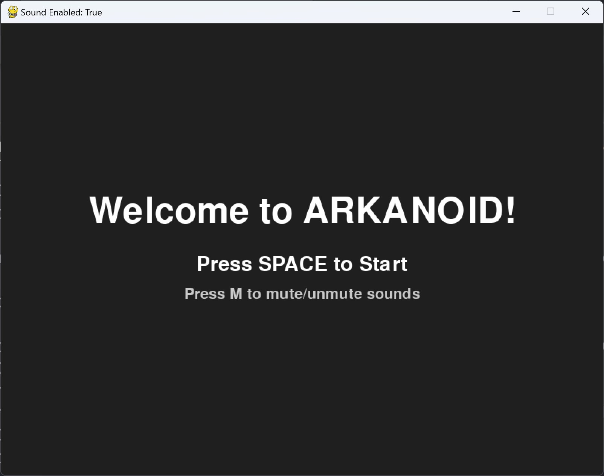

# Arkanoid Game — Pygame Clone 🎮

> A small arcade-style clone of the classic **Arkanoid**,  
> built with **Python 3** and **Pygame**.

  

## 🚀 Features

- 3 levels with increasing difficulty (4 / 5 / 6 rows of bricks)
- Power-ups: **Grow, Glue, Slow, Laser (5 shots), Multi-ball**
- Multi-ball mode — up to **3 balls** active simultaneously
- **0.5s delay** before power-up activation (ensures the player has time to catch it)
- Brick explosion particle effects and victory fireworks
- Sound toggle (`M`), score tracking, lives, level indicator, and remaining laser shots

## 🎮 Controls

| Key                        | Action                                      |
|----------------------------|---------------------------------------------|
| **← / →**                  | Move paddle                                 |
| **Space** (in-game)        | Launch ball / Shoot laser                   |
| **M**                      | Mute / Unmute sound                         |
| **Space** (Title / End)    | Start / Restart the game                    |

## 🛠 Requirements

- Python 3.8+
- Pygame 2.6.1

